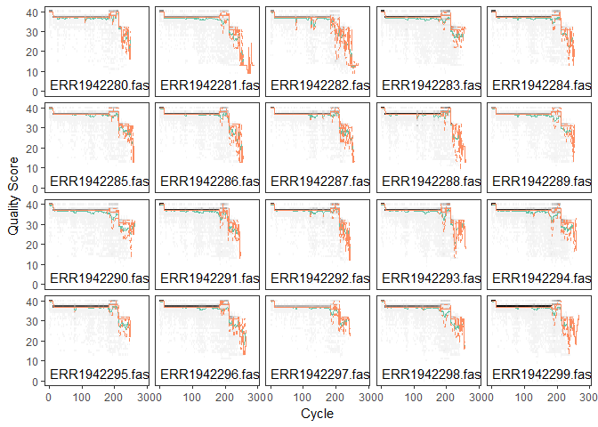
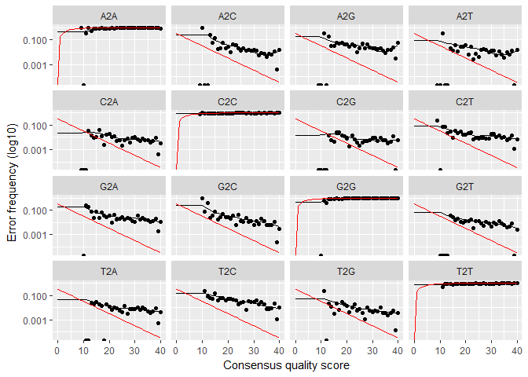
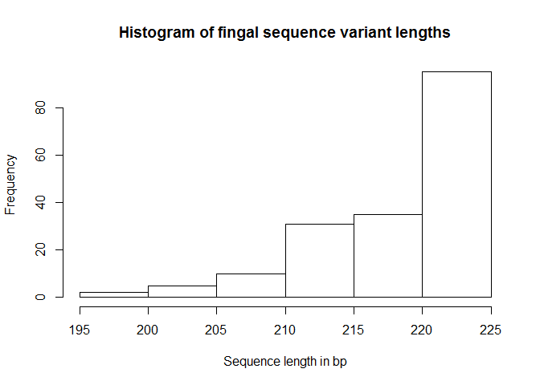
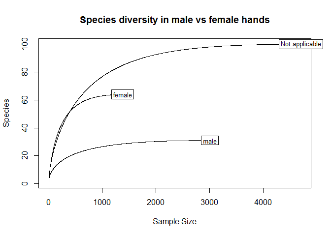
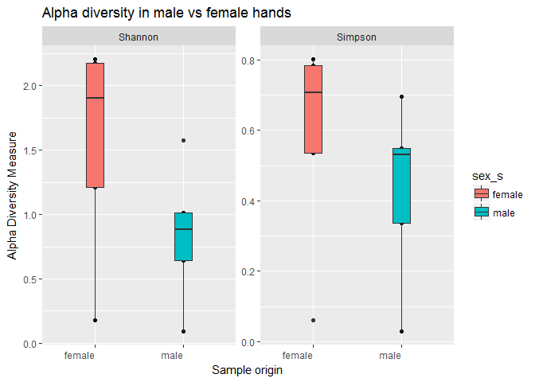
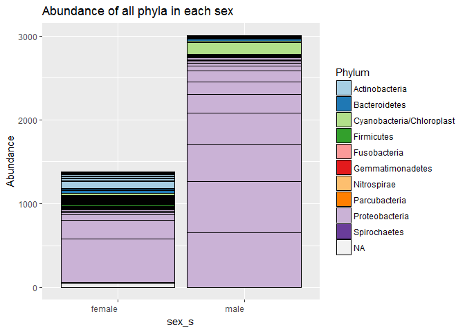
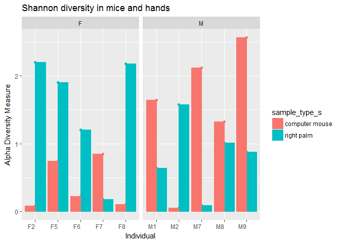
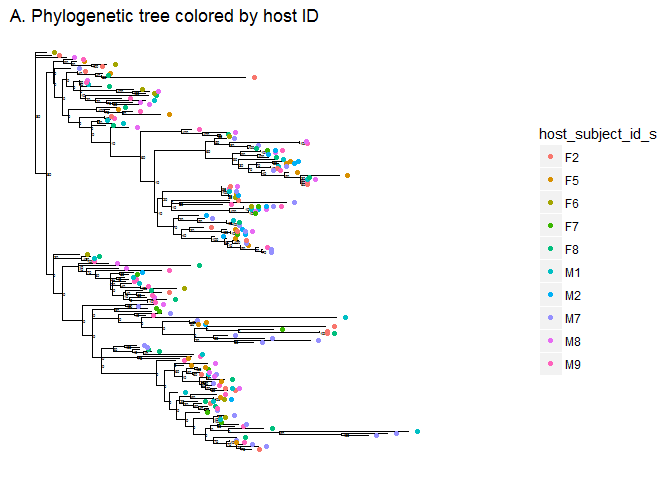

Analysis Report 1: Your Title Here
================
Don Francisco
October 20, 2017

Introduction
============

Add about 1.5-2 pages here. Must cite at least 5 peer reviewed articles.

Methods
=======

Sample origin and sequencing
----------------------------

Fierer *et al.* obtained the riginal samples from human volunteers and the keyboards/mice they touched. They collected them with sterilized cotton-tipped swabs that had been moistened by a sterile solution. They swabbed the hands midday, and swabbed the mice and keyboards within 12 hours of being used by their respective owners. All of the subjects they sampled were healthy, between 20-35 years old, and had not taken antibiotics 6 months before the sampling. They stored all swabs at -80 degrees celcius for less than a week before DNA extraction.Fierer *et al.* obtained the becterial gene sequences using high-throughput pyrosequencing of the 16S ribosomal gene.

Computational
-------------

I proscessed and analyzed the sequence data using a combination of bash and R. First, I used bash to proscess the samples in order to determine their length and quality. Sequences of sufficient quality were then analyzed in R, using all of the relevant metadata and sequence information. R analyses were conducted through the usage of base R, as well as vegan, DADA2, and phyloseq. Vegan was used for various statistical analyses, such as to create rarefaction curves. DADA2 was used for inter-sequence analysis, such as forming OTUs and resolving minor sequence differences (Callahan *et al.*, 2016). Phyloseq was used to add various microbiome-specific functions to ggplot in order to better visualize the data (McMurdie and Holmes, 2013).

Results
=======

In addition to a minimum of 3-4 figures/tables (and associated captions), you should include sufficient text in this section to describe what your findings were. Remember that in the results section you just describe what you found, but you don't interpret it - that happens in the discussion.

``` r
# Be sure to install these packages before running this script
# They can be installed either with the intall.packages() function
# or with the 'Packages' pane in RStudio

# load general-use packages
library("dplyr")
```

    ## Warning: package 'dplyr' was built under R version 3.4.2

``` r
library("tidyr")
```

    ## Warning: package 'tidyr' was built under R version 3.4.2

``` r
library("knitr")
```

    ## Warning: package 'knitr' was built under R version 3.4.2

``` r
library("ggplot2")
```

    ## Warning: package 'ggplot2' was built under R version 3.4.2

``` r
library("vegan")
```

    ## Warning: package 'vegan' was built under R version 3.4.2

``` r
library("RColorBrewer")
```

    ## Warning: package 'RColorBrewer' was built under R version 3.4.1

``` r
# this package allows for the easy inclusion of literature citations in our Rmd
# more info here: https://github.com/crsh/citr
# and here:
# http://rmarkdown.rstudio.com/authoring_bibliographies_and_citations.html
library("citr")
```

    ## Warning: package 'citr' was built under R version 3.4.2

``` r
# These are the primary packages well use to clean and analyze the data
# this package needs to be installed from bioconductor -- it's not on CRAN
# see info here: https://benjjneb.github.io/dada2/dada-installation.html
library("dada2")
```

    ## Warning: package 'Rcpp' was built under R version 3.4.2

``` r
# This to export a fasta of our final denoised sequence variants
library("seqinr")
```

    ## Warning: package 'seqinr' was built under R version 3.4.2

``` r
# To install this you have to install from GitHub
# See more info here: https://github.com/leffj/mctoolsr
# run this -- install.packages("devtools")
# and then this -- devtools::install_github("leffj/mctoolsr")
library("mctoolsr")

# And this to visualize our results
# it also needs to be installed from bioconductor
library("phyloseq")
```

``` r
# NOTE: Much of the following follows the DADA2 tutorials available here:
# https://benjjneb.github.io/dada2/tutorial.html
# Accessed October 19, 2017

# set the base path for our input data files
path <- "data/raw_data"

# Sort ensures samples are in order
filenames_forward_reads <- sort(list.files(path, pattern = ".fastq"))

# Extract sample names, assuming filenames have format: SAMPLENAME.fastq
sample_names <- sapply(strsplit(filenames_forward_reads, "\\."), `[`, 1)

# Specify the full path to each of the filenames_forward_reads
filenames_forward_reads <- file.path(path, filenames_forward_reads)
```

``` r
# Plots the quality profiles of all twenty samples
plotQualityProfile(filenames_forward_reads[1:20])
```



We can see from the quality profiles that most reads tend to get pretty bad in quality after around 200 bases. Therefore, we decided to set a maximum acceptable sequence length of 225 bases.

``` r
# Place filtered files in filtered/ subdirectory
# note this will fail if the directory doesn't exist
filter_path <- file.path("output", "filtered")
filtered_reads_path <- file.path(filter_path,
                                 paste0(sample_names,
                                        "_filt.fastq.gz"))

# See ?filterAndTrim for details on the parameters
# See here for adjustments for 454 data:
# https://benjjneb.github.io/dada2/
#     faq.html#can-i-use-dada2-with-my-454-or-ion-torrent-data
filtered_output <- filterAndTrim(fwd = filenames_forward_reads,
                                 filt = filtered_reads_path,
                                 maxLen = 225,
                                 maxN = 0, # discard any seqs with Ns
                                 maxEE = 3, # allow w/ up to 3 expected errors
                                 truncQ = 2, # cut off if quality gets this low
                                 rm.phix = TRUE,
                                 compress = TRUE,
                                 multithread = FALSE)
```

``` r
# produce nicely-formatted markdown table of read counts
# before/after trimming
kable(filtered_output,
      col.names = c("Reads In",
                    "Reads Out"))
```

|                  |  Reads In|  Reads Out|
|------------------|---------:|----------:|
| ERR1942280.fastq |       404|        350|
| ERR1942281.fastq |       422|        194|
| ERR1942282.fastq |       412|         31|
| ERR1942283.fastq |       791|        426|
| ERR1942284.fastq |       677|        525|
| ERR1942285.fastq |       443|         72|
| ERR1942286.fastq |       667|        617|
| ERR1942287.fastq |       590|        541|
| ERR1942288.fastq |       908|        877|
| ERR1942289.fastq |       372|        147|
| ERR1942290.fastq |       468|        249|
| ERR1942291.fastq |       933|        819|
| ERR1942292.fastq |       724|        709|
| ERR1942293.fastq |       811|        470|
| ERR1942294.fastq |       938|        552|
| ERR1942295.fastq |       705|        620|
| ERR1942296.fastq |       754|        441|
| ERR1942297.fastq |       275|        246|
| ERR1942298.fastq |       562|        389|
| ERR1942299.fastq |      1025|        852|

``` r
# this build error models from each of the samples
errors_forward_reads <- learnErrors(filtered_reads_path,
                                    multithread = FALSE)
```

    ## Not all sequences were the same length.
    ## Not all sequences were the same length.
    ## Not all sequences were the same length.
    ## Not all sequences were the same length.
    ## Not all sequences were the same length.
    ## Not all sequences were the same length.
    ## Not all sequences were the same length.
    ## Not all sequences were the same length.
    ## Not all sequences were the same length.
    ## Not all sequences were the same length.
    ## Not all sequences were the same length.
    ## Not all sequences were the same length.
    ## Not all sequences were the same length.
    ## Not all sequences were the same length.
    ## Not all sequences were the same length.
    ## Not all sequences were the same length.
    ## Not all sequences were the same length.
    ## Not all sequences were the same length.
    ## Not all sequences were the same length.
    ## Not all sequences were the same length.
    ## Initializing error rates to maximum possible estimate.
    ## Sample 1 - 350 reads in 72 unique sequences.
    ## Sample 2 - 194 reads in 163 unique sequences.
    ## Sample 3 - 31 reads in 25 unique sequences.
    ## Sample 4 - 426 reads in 176 unique sequences.
    ## Sample 5 - 525 reads in 134 unique sequences.
    ## Sample 6 - 72 reads in 65 unique sequences.
    ## Sample 7 - 617 reads in 178 unique sequences.
    ## Sample 8 - 541 reads in 135 unique sequences.
    ## Sample 9 - 877 reads in 201 unique sequences.
    ## Sample 10 - 147 reads in 107 unique sequences.
    ## Sample 11 - 249 reads in 181 unique sequences.
    ## Sample 12 - 819 reads in 212 unique sequences.
    ## Sample 13 - 709 reads in 128 unique sequences.
    ## Sample 14 - 470 reads in 171 unique sequences.
    ## Sample 15 - 552 reads in 250 unique sequences.
    ## Sample 16 - 620 reads in 141 unique sequences.
    ## Sample 17 - 441 reads in 186 unique sequences.
    ## Sample 18 - 246 reads in 88 unique sequences.
    ## Sample 19 - 389 reads in 332 unique sequences.
    ## Sample 20 - 852 reads in 239 unique sequences.
    ##    selfConsist step 2 
    ##    selfConsist step 3 
    ## 
    ## 
    ## Convergence after  3  rounds.
    ## Total reads used:  9127

``` r
# quick check to see if error models match data
# (black lines match black points) and are generally decresing left to right
plotErrors(errors_forward_reads,
           nominalQ = TRUE)
```

    ## Warning: Transformation introduced infinite values in continuous y-axis

    ## Warning: Transformation introduced infinite values in continuous y-axis



``` r
# get rid of any duplicated sequences
dereplicated_forward_reads <- derepFastq(filtered_reads_path,
                                         verbose = TRUE)
```

    ## Dereplicating sequence entries in Fastq file: output/filtered/ERR1942280_filt.fastq.gz

    ## Encountered 72 unique sequences from 350 total sequences read.

    ## Not all sequences were the same length.

    ## Dereplicating sequence entries in Fastq file: output/filtered/ERR1942281_filt.fastq.gz

    ## Encountered 163 unique sequences from 194 total sequences read.

    ## Not all sequences were the same length.

    ## Dereplicating sequence entries in Fastq file: output/filtered/ERR1942282_filt.fastq.gz

    ## Encountered 25 unique sequences from 31 total sequences read.

    ## Not all sequences were the same length.

    ## Dereplicating sequence entries in Fastq file: output/filtered/ERR1942283_filt.fastq.gz

    ## Encountered 176 unique sequences from 426 total sequences read.

    ## Not all sequences were the same length.

    ## Dereplicating sequence entries in Fastq file: output/filtered/ERR1942284_filt.fastq.gz

    ## Encountered 134 unique sequences from 525 total sequences read.

    ## Not all sequences were the same length.

    ## Dereplicating sequence entries in Fastq file: output/filtered/ERR1942285_filt.fastq.gz

    ## Encountered 65 unique sequences from 72 total sequences read.

    ## Not all sequences were the same length.

    ## Dereplicating sequence entries in Fastq file: output/filtered/ERR1942286_filt.fastq.gz

    ## Encountered 178 unique sequences from 617 total sequences read.

    ## Not all sequences were the same length.

    ## Dereplicating sequence entries in Fastq file: output/filtered/ERR1942287_filt.fastq.gz

    ## Encountered 135 unique sequences from 541 total sequences read.

    ## Not all sequences were the same length.

    ## Dereplicating sequence entries in Fastq file: output/filtered/ERR1942288_filt.fastq.gz

    ## Encountered 201 unique sequences from 877 total sequences read.

    ## Not all sequences were the same length.

    ## Dereplicating sequence entries in Fastq file: output/filtered/ERR1942289_filt.fastq.gz

    ## Encountered 107 unique sequences from 147 total sequences read.

    ## Not all sequences were the same length.

    ## Dereplicating sequence entries in Fastq file: output/filtered/ERR1942290_filt.fastq.gz

    ## Encountered 181 unique sequences from 249 total sequences read.

    ## Not all sequences were the same length.

    ## Dereplicating sequence entries in Fastq file: output/filtered/ERR1942291_filt.fastq.gz

    ## Encountered 212 unique sequences from 819 total sequences read.

    ## Not all sequences were the same length.

    ## Dereplicating sequence entries in Fastq file: output/filtered/ERR1942292_filt.fastq.gz

    ## Encountered 128 unique sequences from 709 total sequences read.

    ## Not all sequences were the same length.

    ## Dereplicating sequence entries in Fastq file: output/filtered/ERR1942293_filt.fastq.gz

    ## Encountered 171 unique sequences from 470 total sequences read.

    ## Not all sequences were the same length.

    ## Dereplicating sequence entries in Fastq file: output/filtered/ERR1942294_filt.fastq.gz

    ## Encountered 250 unique sequences from 552 total sequences read.

    ## Not all sequences were the same length.

    ## Dereplicating sequence entries in Fastq file: output/filtered/ERR1942295_filt.fastq.gz

    ## Encountered 141 unique sequences from 620 total sequences read.

    ## Not all sequences were the same length.

    ## Dereplicating sequence entries in Fastq file: output/filtered/ERR1942296_filt.fastq.gz

    ## Encountered 186 unique sequences from 441 total sequences read.

    ## Not all sequences were the same length.

    ## Dereplicating sequence entries in Fastq file: output/filtered/ERR1942297_filt.fastq.gz

    ## Encountered 88 unique sequences from 246 total sequences read.

    ## Not all sequences were the same length.

    ## Dereplicating sequence entries in Fastq file: output/filtered/ERR1942298_filt.fastq.gz

    ## Encountered 332 unique sequences from 389 total sequences read.

    ## Not all sequences were the same length.

    ## Dereplicating sequence entries in Fastq file: output/filtered/ERR1942299_filt.fastq.gz

    ## Encountered 239 unique sequences from 852 total sequences read.

    ## Not all sequences were the same length.

``` r
# Name the derep-class objects by the sample names
names(dereplicated_forward_reads) <- sample_names
```

``` r
# parameters adjusted based on recommendations for 454 data here:
# https://benjjneb.github.io/dada2/
#     faq.html#can-i-use-dada2-with-my-454-or-ion-torrent-data
dada_forward_reads <- dada(dereplicated_forward_reads,
                           err = errors_forward_reads,
                           HOMOPOLYMER_GAP_PENALTY = -1, # reduce penalty bc 454
                           BAND_SIZE = 32) # performs local alignments bc indels
```

    ## Sample 1 - 350 reads in 72 unique sequences.
    ## Sample 2 - 194 reads in 163 unique sequences.
    ## Sample 3 - 31 reads in 25 unique sequences.
    ## Sample 4 - 426 reads in 176 unique sequences.
    ## Sample 5 - 525 reads in 134 unique sequences.
    ## Sample 6 - 72 reads in 65 unique sequences.
    ## Sample 7 - 617 reads in 178 unique sequences.
    ## Sample 8 - 541 reads in 135 unique sequences.
    ## Sample 9 - 877 reads in 201 unique sequences.
    ## Sample 10 - 147 reads in 107 unique sequences.
    ## Sample 11 - 249 reads in 181 unique sequences.
    ## Sample 12 - 819 reads in 212 unique sequences.
    ## Sample 13 - 709 reads in 128 unique sequences.
    ## Sample 14 - 470 reads in 171 unique sequences.
    ## Sample 15 - 552 reads in 250 unique sequences.
    ## Sample 16 - 620 reads in 141 unique sequences.
    ## Sample 17 - 441 reads in 186 unique sequences.
    ## Sample 18 - 246 reads in 88 unique sequences.
    ## Sample 19 - 389 reads in 332 unique sequences.
    ## Sample 20 - 852 reads in 239 unique sequences.

``` r
# check dada results
dada_forward_reads
```

    ## $ERR1942280
    ## dada-class: object describing DADA2 denoising results
    ## 3 sample sequences were inferred from 72 input unique sequences.
    ## Key parameters: OMEGA_A = 1e-40, BAND_SIZE = 32, USE_QUALS = TRUE
    ## 
    ## $ERR1942281
    ## dada-class: object describing DADA2 denoising results
    ## 18 sample sequences were inferred from 163 input unique sequences.
    ## Key parameters: OMEGA_A = 1e-40, BAND_SIZE = 32, USE_QUALS = TRUE
    ## 
    ## $ERR1942282
    ## dada-class: object describing DADA2 denoising results
    ## 3 sample sequences were inferred from 25 input unique sequences.
    ## Key parameters: OMEGA_A = 1e-40, BAND_SIZE = 32, USE_QUALS = TRUE
    ## 
    ## $ERR1942283
    ## dada-class: object describing DADA2 denoising results
    ## 17 sample sequences were inferred from 176 input unique sequences.
    ## Key parameters: OMEGA_A = 1e-40, BAND_SIZE = 32, USE_QUALS = TRUE
    ## 
    ## $ERR1942284
    ## dada-class: object describing DADA2 denoising results
    ## 4 sample sequences were inferred from 134 input unique sequences.
    ## Key parameters: OMEGA_A = 1e-40, BAND_SIZE = 32, USE_QUALS = TRUE
    ## 
    ## $ERR1942285
    ## dada-class: object describing DADA2 denoising results
    ## 7 sample sequences were inferred from 65 input unique sequences.
    ## Key parameters: OMEGA_A = 1e-40, BAND_SIZE = 32, USE_QUALS = TRUE
    ## 
    ## $ERR1942286
    ## dada-class: object describing DADA2 denoising results
    ## 8 sample sequences were inferred from 178 input unique sequences.
    ## Key parameters: OMEGA_A = 1e-40, BAND_SIZE = 32, USE_QUALS = TRUE
    ## 
    ## $ERR1942287
    ## dada-class: object describing DADA2 denoising results
    ## 5 sample sequences were inferred from 135 input unique sequences.
    ## Key parameters: OMEGA_A = 1e-40, BAND_SIZE = 32, USE_QUALS = TRUE
    ## 
    ## $ERR1942288
    ## dada-class: object describing DADA2 denoising results
    ## 5 sample sequences were inferred from 201 input unique sequences.
    ## Key parameters: OMEGA_A = 1e-40, BAND_SIZE = 32, USE_QUALS = TRUE
    ## 
    ## $ERR1942289
    ## dada-class: object describing DADA2 denoising results
    ## 17 sample sequences were inferred from 107 input unique sequences.
    ## Key parameters: OMEGA_A = 1e-40, BAND_SIZE = 32, USE_QUALS = TRUE
    ## 
    ## $ERR1942290
    ## dada-class: object describing DADA2 denoising results
    ## 13 sample sequences were inferred from 181 input unique sequences.
    ## Key parameters: OMEGA_A = 1e-40, BAND_SIZE = 32, USE_QUALS = TRUE
    ## 
    ## $ERR1942291
    ## dada-class: object describing DADA2 denoising results
    ## 8 sample sequences were inferred from 212 input unique sequences.
    ## Key parameters: OMEGA_A = 1e-40, BAND_SIZE = 32, USE_QUALS = TRUE
    ## 
    ## $ERR1942292
    ## dada-class: object describing DADA2 denoising results
    ## 3 sample sequences were inferred from 128 input unique sequences.
    ## Key parameters: OMEGA_A = 1e-40, BAND_SIZE = 32, USE_QUALS = TRUE
    ## 
    ## $ERR1942293
    ## dada-class: object describing DADA2 denoising results
    ## 11 sample sequences were inferred from 171 input unique sequences.
    ## Key parameters: OMEGA_A = 1e-40, BAND_SIZE = 32, USE_QUALS = TRUE
    ## 
    ## $ERR1942294
    ## dada-class: object describing DADA2 denoising results
    ## 30 sample sequences were inferred from 250 input unique sequences.
    ## Key parameters: OMEGA_A = 1e-40, BAND_SIZE = 32, USE_QUALS = TRUE
    ## 
    ## $ERR1942295
    ## dada-class: object describing DADA2 denoising results
    ## 4 sample sequences were inferred from 141 input unique sequences.
    ## Key parameters: OMEGA_A = 1e-40, BAND_SIZE = 32, USE_QUALS = TRUE
    ## 
    ## $ERR1942296
    ## dada-class: object describing DADA2 denoising results
    ## 17 sample sequences were inferred from 186 input unique sequences.
    ## Key parameters: OMEGA_A = 1e-40, BAND_SIZE = 32, USE_QUALS = TRUE
    ## 
    ## $ERR1942297
    ## dada-class: object describing DADA2 denoising results
    ## 5 sample sequences were inferred from 88 input unique sequences.
    ## Key parameters: OMEGA_A = 1e-40, BAND_SIZE = 32, USE_QUALS = TRUE
    ## 
    ## $ERR1942298
    ## dada-class: object describing DADA2 denoising results
    ## 21 sample sequences were inferred from 332 input unique sequences.
    ## Key parameters: OMEGA_A = 1e-40, BAND_SIZE = 32, USE_QUALS = TRUE
    ## 
    ## $ERR1942299
    ## dada-class: object describing DADA2 denoising results
    ## 8 sample sequences were inferred from 239 input unique sequences.
    ## Key parameters: OMEGA_A = 1e-40, BAND_SIZE = 32, USE_QUALS = TRUE

``` r
# produce the 'site by species matrix'
sequence_table <- makeSequenceTable(dada_forward_reads)
```

    ## The sequences being tabled vary in length.

The output table has 20 rows (samples) and 178 columns (sequence variants). Notice how we can embed R code directly in our markdown text.

``` r
# Quick check to look at distribution of trimmed and denoised sequences
hist(nchar(getSequences(sequence_table)),
     main = "Histogram of fingal sequence variant lengths",
     xlab = "Sequence length in bp")
```



``` r
# Check for and remove chimeras
sequence_table_nochim <- removeBimeraDenovo(sequence_table,
                                            method = "consensus",
                                            multithread = FALSE,
                                            verbose = TRUE)
```

    ## Identified 2 bimeras out of 178 input sequences.

``` r
# What percent of our reads are non-chimeric?
non_chimeric_reads <- round(sum(sequence_table_nochim) / sum(sequence_table),
                            digits = 4) * 100
```

After removing chimeras, we were left with 99.65% of our cleaned reads.

``` r
# Build a table showing how many sequences remain at each step of the pipeline
get_n <- function(x) sum(getUniques(x)) # make a quick function
track <- cbind(filtered_output, # already has 2 columns
               sapply(dada_forward_reads, get_n),
               rowSums(sequence_table),
               rowSums(sequence_table_nochim))

# add nice meaningful column names
colnames(track) <- c("Input",
                     "Filtered",
                     "Denoised",
                     "Sequence Table",
                     "Non-chimeric")

# set the proper rownames
rownames(track) <- sample_names

# produce nice markdown table of progress through the pipeline
kable(track)
```

|            |  Input|  Filtered|  Denoised|  Sequence Table|  Non-chimeric|
|------------|------:|---------:|---------:|---------------:|-------------:|
| ERR1942280 |    404|       350|       350|             350|           350|
| ERR1942281 |    422|       194|       194|             194|           194|
| ERR1942282 |    412|        31|        31|              31|            31|
| ERR1942283 |    791|       426|       426|             426|           426|
| ERR1942284 |    677|       525|       525|             525|           525|
| ERR1942285 |    443|        72|        72|              72|            72|
| ERR1942286 |    667|       617|       617|             617|           585|
| ERR1942287 |    590|       541|       541|             541|           541|
| ERR1942288 |    908|       877|       877|             877|           877|
| ERR1942289 |    372|       147|       147|             147|           147|
| ERR1942290 |    468|       249|       249|             249|           249|
| ERR1942291 |    933|       819|       819|             819|           819|
| ERR1942292 |    724|       709|       709|             709|           709|
| ERR1942293 |    811|       470|       470|             470|           470|
| ERR1942294 |    938|       552|       552|             552|           552|
| ERR1942295 |    705|       620|       620|             620|           620|
| ERR1942296 |    754|       441|       441|             441|           441|
| ERR1942297 |    275|       246|       246|             246|           246|
| ERR1942298 |    562|       389|       389|             389|           389|
| ERR1942299 |   1025|       852|       852|             852|           852|

``` r
# assigns taxonomy to each sequence variant based on a supplied training set
# made up of known sequences
taxa <- assignTaxonomy(sequence_table_nochim,
                       "data/training/rdp_train_set_16.fa.gz",
                       multithread = FALSE,
                       tryRC = TRUE) # also check with seq reverse compliments

# show the results of the taxonomy assignment
unname(taxa)
```

    ##        [,1]       [,2]                        [,3]                 
    ##   [1,] "Bacteria" "Proteobacteria"            NA                   
    ##   [2,] "Bacteria" "Proteobacteria"            "Alphaproteobacteria"
    ##   [3,] "Bacteria" "Bacteroidetes"             NA                   
    ##   [4,] "Bacteria" "Proteobacteria"            NA                   
    ##   [5,] "Bacteria" "Proteobacteria"            "Betaproteobacteria" 
    ##   [6,] "Bacteria" "Cyanobacteria/Chloroplast" "Chloroplast"        
    ##   [7,] "Bacteria" "Proteobacteria"            "Betaproteobacteria" 
    ##   [8,] "Bacteria" "Bacteroidetes"             "Cytophagia"         
    ##   [9,] "Bacteria" "Proteobacteria"            "Alphaproteobacteria"
    ##  [10,] "Bacteria" "Proteobacteria"            "Betaproteobacteria" 
    ##  [11,] "Bacteria" "Proteobacteria"            NA                   
    ##  [12,] "Bacteria" "Actinobacteria"            "Actinobacteria"     
    ##  [13,] "Bacteria" "Cyanobacteria/Chloroplast" "Chloroplast"        
    ##  [14,] "Bacteria" "Proteobacteria"            "Betaproteobacteria" 
    ##  [15,] "Bacteria" "Proteobacteria"            "Betaproteobacteria" 
    ##  [16,] "Bacteria" "Proteobacteria"            NA                   
    ##  [17,] "Bacteria" "Bacteroidetes"             "Flavobacteriia"     
    ##  [18,] "Bacteria" "Firmicutes"                "Clostridia"         
    ##  [19,] "Bacteria" NA                          NA                   
    ##  [20,] "Bacteria" "Proteobacteria"            "Betaproteobacteria" 
    ##  [21,] "Bacteria" "Firmicutes"                "Clostridia"         
    ##  [22,] "Bacteria" "Firmicutes"                "Clostridia"         
    ##  [23,] "Bacteria" "Firmicutes"                "Clostridia"         
    ##  [24,] "Bacteria" "Firmicutes"                "Clostridia"         
    ##  [25,] "Bacteria" "Proteobacteria"            "Betaproteobacteria" 
    ##  [26,] "Bacteria" "Cyanobacteria/Chloroplast" "Chloroplast"        
    ##  [27,] "Bacteria" "Firmicutes"                "Clostridia"         
    ##  [28,] "Bacteria" "Actinobacteria"            "Actinobacteria"     
    ##  [29,] "Bacteria" "Firmicutes"                "Clostridia"         
    ##  [30,] "Bacteria" "Proteobacteria"            "Alphaproteobacteria"
    ##  [31,] "Bacteria" "Actinobacteria"            "Actinobacteria"     
    ##  [32,] "Bacteria" "Actinobacteria"            "Actinobacteria"     
    ##  [33,] "Bacteria" "Actinobacteria"            "Actinobacteria"     
    ##  [34,] "Bacteria" "Actinobacteria"            "Actinobacteria"     
    ##  [35,] "Bacteria" "Firmicutes"                "Clostridia"         
    ##  [36,] "Bacteria" "Proteobacteria"            "Betaproteobacteria" 
    ##  [37,] "Bacteria" "Proteobacteria"            "Alphaproteobacteria"
    ##  [38,] "Bacteria" "Actinobacteria"            "Actinobacteria"     
    ##  [39,] "Bacteria" "Cyanobacteria/Chloroplast" "Chloroplast"        
    ##  [40,] "Bacteria" "Bacteroidetes"             "Flavobacteriia"     
    ##  [41,] "Bacteria" "Firmicutes"                "Bacilli"            
    ##  [42,] "Bacteria" "Firmicutes"                "Clostridia"         
    ##  [43,] "Bacteria" "Proteobacteria"            "Betaproteobacteria" 
    ##  [44,] "Bacteria" "Firmicutes"                "Clostridia"         
    ##  [45,] "Bacteria" "Proteobacteria"            "Gammaproteobacteria"
    ##  [46,] "Bacteria" "Actinobacteria"            "Actinobacteria"     
    ##  [47,] "Bacteria" "Firmicutes"                "Clostridia"         
    ##  [48,] "Bacteria" "Proteobacteria"            "Betaproteobacteria" 
    ##  [49,] "Bacteria" "Actinobacteria"            "Actinobacteria"     
    ##  [50,] "Bacteria" "Actinobacteria"            "Actinobacteria"     
    ##  [51,] "Bacteria" "Actinobacteria"            "Actinobacteria"     
    ##  [52,] "Bacteria" "Firmicutes"                "Clostridia"         
    ##  [53,] "Bacteria" "Actinobacteria"            "Actinobacteria"     
    ##  [54,] "Bacteria" "Proteobacteria"            "Alphaproteobacteria"
    ##  [55,] "Bacteria" "Firmicutes"                NA                   
    ##  [56,] "Bacteria" "Actinobacteria"            "Actinobacteria"     
    ##  [57,] "Bacteria" "Firmicutes"                "Clostridia"         
    ##  [58,] "Bacteria" "Proteobacteria"            "Gammaproteobacteria"
    ##  [59,] "Bacteria" "Proteobacteria"            NA                   
    ##  [60,] "Bacteria" "Firmicutes"                "Clostridia"         
    ##  [61,] "Bacteria" "Firmicutes"                "Clostridia"         
    ##  [62,] "Bacteria" "Proteobacteria"            "Alphaproteobacteria"
    ##  [63,] "Bacteria" "Firmicutes"                NA                   
    ##  [64,] "Bacteria" "Actinobacteria"            "Actinobacteria"     
    ##  [65,] "Bacteria" "Actinobacteria"            "Actinobacteria"     
    ##  [66,] "Bacteria" "Actinobacteria"            "Actinobacteria"     
    ##  [67,] "Bacteria" "Proteobacteria"            "Alphaproteobacteria"
    ##  [68,] "Bacteria" "Firmicutes"                "Clostridia"         
    ##  [69,] "Bacteria" "Firmicutes"                "Clostridia"         
    ##  [70,] "Bacteria" "Proteobacteria"            "Alphaproteobacteria"
    ##  [71,] "Bacteria" "Firmicutes"                "Clostridia"         
    ##  [72,] "Bacteria" "Proteobacteria"            "Betaproteobacteria" 
    ##  [73,] "Bacteria" "Firmicutes"                "Clostridia"         
    ##  [74,] "Bacteria" "Actinobacteria"            "Actinobacteria"     
    ##  [75,] "Bacteria" "Cyanobacteria/Chloroplast" "Chloroplast"        
    ##  [76,] "Bacteria" "Firmicutes"                "Clostridia"         
    ##  [77,] "Bacteria" "Actinobacteria"            "Actinobacteria"     
    ##  [78,] "Bacteria" "Actinobacteria"            "Actinobacteria"     
    ##  [79,] "Bacteria" "Actinobacteria"            "Actinobacteria"     
    ##  [80,] "Bacteria" "Firmicutes"                "Clostridia"         
    ##  [81,] "Bacteria" "Bacteroidetes"             "Flavobacteriia"     
    ##  [82,] "Bacteria" "Actinobacteria"            "Actinobacteria"     
    ##  [83,] "Bacteria" "Proteobacteria"            "Alphaproteobacteria"
    ##  [84,] "Bacteria" "Firmicutes"                "Clostridia"         
    ##  [85,] "Bacteria" "Proteobacteria"            "Betaproteobacteria" 
    ##  [86,] "Bacteria" "Proteobacteria"            "Alphaproteobacteria"
    ##  [87,] "Bacteria" "Cyanobacteria/Chloroplast" "Chloroplast"        
    ##  [88,] "Bacteria" "Firmicutes"                "Clostridia"         
    ##  [89,] "Bacteria" "Proteobacteria"            "Gammaproteobacteria"
    ##  [90,] "Bacteria" "Proteobacteria"            "Betaproteobacteria" 
    ##  [91,] "Bacteria" "Gemmatimonadetes"          "Gemmatimonadetes"   
    ##  [92,] "Bacteria" "Actinobacteria"            "Actinobacteria"     
    ##  [93,] "Bacteria" "Proteobacteria"            "Betaproteobacteria" 
    ##  [94,] "Bacteria" "Firmicutes"                "Bacilli"            
    ##  [95,] "Bacteria" "Firmicutes"                "Clostridia"         
    ##  [96,] "Bacteria" "Actinobacteria"            "Actinobacteria"     
    ##  [97,] "Bacteria" "Proteobacteria"            NA                   
    ##  [98,] "Bacteria" "Actinobacteria"            "Actinobacteria"     
    ##  [99,] "Bacteria" "Actinobacteria"            "Actinobacteria"     
    ## [100,] "Bacteria" "Firmicutes"                "Clostridia"         
    ## [101,] "Bacteria" "Firmicutes"                "Clostridia"         
    ## [102,] "Bacteria" "Firmicutes"                "Clostridia"         
    ## [103,] "Bacteria" "Firmicutes"                "Clostridia"         
    ## [104,] "Bacteria" "Actinobacteria"            "Actinobacteria"     
    ## [105,] "Bacteria" "Firmicutes"                "Clostridia"         
    ## [106,] "Bacteria" NA                          NA                   
    ## [107,] "Bacteria" "Firmicutes"                "Clostridia"         
    ## [108,] "Bacteria" "Bacteroidetes"             "Sphingobacteriia"   
    ## [109,] "Bacteria" "Firmicutes"                "Bacilli"            
    ## [110,] "Bacteria" "Gemmatimonadetes"          "Gemmatimonadetes"   
    ## [111,] "Bacteria" "Actinobacteria"            "Actinobacteria"     
    ## [112,] "Bacteria" "Firmicutes"                "Bacilli"            
    ## [113,] "Bacteria" "Bacteroidetes"             "Sphingobacteriia"   
    ## [114,] "Bacteria" "Firmicutes"                "Clostridia"         
    ## [115,] "Bacteria" "Firmicutes"                "Clostridia"         
    ## [116,] "Bacteria" "Firmicutes"                "Clostridia"         
    ## [117,] "Bacteria" "Actinobacteria"            "Actinobacteria"     
    ## [118,] "Bacteria" "Proteobacteria"            "Alphaproteobacteria"
    ## [119,] "Bacteria" "Firmicutes"                "Clostridia"         
    ## [120,] "Bacteria" "Firmicutes"                "Clostridia"         
    ## [121,] "Bacteria" "Proteobacteria"            "Alphaproteobacteria"
    ## [122,] "Bacteria" "Firmicutes"                "Clostridia"         
    ## [123,] "Bacteria" "Actinobacteria"            "Actinobacteria"     
    ## [124,] "Bacteria" "Firmicutes"                "Bacilli"            
    ## [125,] "Bacteria" "Firmicutes"                "Clostridia"         
    ## [126,] "Bacteria" "Firmicutes"                "Bacilli"            
    ## [127,] "Bacteria" "Firmicutes"                "Clostridia"         
    ## [128,] "Bacteria" "Proteobacteria"            "Alphaproteobacteria"
    ## [129,] "Bacteria" "Proteobacteria"            "Alphaproteobacteria"
    ## [130,] "Bacteria" "Spirochaetes"              "Spirochaetia"       
    ## [131,] "Bacteria" "Firmicutes"                "Clostridia"         
    ## [132,] "Bacteria" NA                          NA                   
    ## [133,] "Bacteria" "Firmicutes"                NA                   
    ## [134,] "Bacteria" "Proteobacteria"            "Gammaproteobacteria"
    ## [135,] "Bacteria" "Firmicutes"                "Clostridia"         
    ## [136,] "Bacteria" "Proteobacteria"            "Alphaproteobacteria"
    ## [137,] "Bacteria" "Proteobacteria"            "Alphaproteobacteria"
    ## [138,] "Bacteria" "Firmicutes"                "Clostridia"         
    ## [139,] "Bacteria" "Proteobacteria"            "Betaproteobacteria" 
    ## [140,] "Bacteria" "Firmicutes"                "Erysipelotrichia"   
    ## [141,] "Bacteria" "Actinobacteria"            "Actinobacteria"     
    ## [142,] "Bacteria" "Actinobacteria"            "Actinobacteria"     
    ## [143,] "Bacteria" "Firmicutes"                "Clostridia"         
    ## [144,] "Bacteria" "Actinobacteria"            "Actinobacteria"     
    ## [145,] "Bacteria" "Firmicutes"                "Clostridia"         
    ## [146,] "Bacteria" "Actinobacteria"            "Actinobacteria"     
    ## [147,] "Bacteria" "Firmicutes"                "Clostridia"         
    ## [148,] "Bacteria" "Bacteroidetes"             "Sphingobacteriia"   
    ## [149,] "Bacteria" "Firmicutes"                "Clostridia"         
    ## [150,] "Bacteria" "Proteobacteria"            "Alphaproteobacteria"
    ## [151,] "Bacteria" "Actinobacteria"            "Actinobacteria"     
    ## [152,] "Bacteria" "Firmicutes"                "Clostridia"         
    ## [153,] "Bacteria" "Bacteroidetes"             "Bacteroidia"        
    ## [154,] "Bacteria" NA                          NA                   
    ## [155,] "Bacteria" "Proteobacteria"            NA                   
    ## [156,] "Bacteria" "Firmicutes"                "Clostridia"         
    ## [157,] "Bacteria" "Firmicutes"                "Clostridia"         
    ## [158,] "Bacteria" "Firmicutes"                "Clostridia"         
    ## [159,] "Bacteria" "Firmicutes"                "Bacilli"            
    ## [160,] "Bacteria" "Bacteroidetes"             "Flavobacteriia"     
    ## [161,] "Bacteria" "Fusobacteria"              "Fusobacteriia"      
    ## [162,] "Bacteria" "Firmicutes"                "Clostridia"         
    ## [163,] "Bacteria" "Firmicutes"                "Bacilli"            
    ## [164,] "Bacteria" "Firmicutes"                "Clostridia"         
    ## [165,] "Bacteria" "Nitrospirae"               "Nitrospira"         
    ## [166,] "Bacteria" "Parcubacteria"             NA                   
    ## [167,] "Bacteria" "Firmicutes"                "Bacilli"            
    ## [168,] "Bacteria" "Proteobacteria"            "Betaproteobacteria" 
    ## [169,] "Bacteria" "Bacteroidetes"             "Sphingobacteriia"   
    ## [170,] "Bacteria" "Actinobacteria"            "Actinobacteria"     
    ## [171,] "Bacteria" "Proteobacteria"            "Alphaproteobacteria"
    ## [172,] "Bacteria" "Firmicutes"                "Clostridia"         
    ## [173,] "Bacteria" "Firmicutes"                "Clostridia"         
    ## [174,] "Bacteria" "Actinobacteria"            "Actinobacteria"     
    ## [175,] "Bacteria" "Proteobacteria"            "Gammaproteobacteria"
    ## [176,] "Bacteria" "Actinobacteria"            "Actinobacteria"     
    ##        [,4]                 [,5]                  
    ##   [1,] NA                   NA                    
    ##   [2,] "Rhizobiales"        "Bartonellaceae"      
    ##   [3,] NA                   NA                    
    ##   [4,] NA                   NA                    
    ##   [5,] "Neisseriales"       "Neisseriaceae"       
    ##   [6,] "Chloroplast"        "Streptophyta"        
    ##   [7,] "Burkholderiales"    "Comamonadaceae"      
    ##   [8,] "Cytophagales"       NA                    
    ##   [9,] "Rhizobiales"        "Bartonellaceae"      
    ##  [10,] "Burkholderiales"    "Oxalobacteraceae"    
    ##  [11,] NA                   NA                    
    ##  [12,] "Actinomycetales"    "Nocardiaceae"        
    ##  [13,] "Chloroplast"        "Streptophyta"        
    ##  [14,] "Burkholderiales"    "Oxalobacteraceae"    
    ##  [15,] "Neisseriales"       "Neisseriaceae"       
    ##  [16,] NA                   NA                    
    ##  [17,] "Flavobacteriales"   "Flavobacteriaceae"   
    ##  [18,] "Clostridiales"      "Lachnospiraceae"     
    ##  [19,] NA                   NA                    
    ##  [20,] "Burkholderiales"    "Comamonadaceae"      
    ##  [21,] "Clostridiales"      "Ruminococcaceae"     
    ##  [22,] "Clostridiales"      "Ruminococcaceae"     
    ##  [23,] "Clostridiales"      "Ruminococcaceae"     
    ##  [24,] "Clostridiales"      "Lachnospiraceae"     
    ##  [25,] "Burkholderiales"    "Comamonadaceae"      
    ##  [26,] "Chloroplast"        "Streptophyta"        
    ##  [27,] "Clostridiales"      "Ruminococcaceae"     
    ##  [28,] "Actinomycetales"    "Streptomycetaceae"   
    ##  [29,] "Clostridiales"      "Ruminococcaceae"     
    ##  [30,] "Sphingomonadales"   "Sphingomonadaceae"   
    ##  [31,] "Actinomycetales"    "Nocardioidaceae"     
    ##  [32,] "Actinomycetales"    "Streptomycetaceae"   
    ##  [33,] "Actinomycetales"    "Microbacteriaceae"   
    ##  [34,] "Actinomycetales"    "Streptomycetaceae"   
    ##  [35,] "Clostridiales"      "Ruminococcaceae"     
    ##  [36,] "Methylophilales"    "Methylophilaceae"    
    ##  [37,] "Sphingomonadales"   "Sphingomonadaceae"   
    ##  [38,] "Actinomycetales"    "Intrasporangiaceae"  
    ##  [39,] "Chloroplast"        "Streptophyta"        
    ##  [40,] "Flavobacteriales"   "Flavobacteriaceae"   
    ##  [41,] "Lactobacillales"    "Streptococcaceae"    
    ##  [42,] "Clostridiales"      "Ruminococcaceae"     
    ##  [43,] "Rhodocyclales"      "Rhodocyclaceae"      
    ##  [44,] "Clostridiales"      "Ruminococcaceae"     
    ##  [45,] "Pseudomonadales"    "Pseudomonadaceae"    
    ##  [46,] "Actinomycetales"    "Streptomycetaceae"   
    ##  [47,] "Clostridiales"      "Lachnospiraceae"     
    ##  [48,] "Burkholderiales"    "Comamonadaceae"      
    ##  [49,] "Actinomycetales"    "Microbacteriaceae"   
    ##  [50,] "Actinomycetales"    "Mycobacteriaceae"    
    ##  [51,] "Actinomycetales"    "Nocardioidaceae"     
    ##  [52,] "Clostridiales"      "Lachnospiraceae"     
    ##  [53,] "Actinomycetales"    "Streptomycetaceae"   
    ##  [54,] "Sphingomonadales"   "Sphingomonadaceae"   
    ##  [55,] NA                   NA                    
    ##  [56,] "Actinomycetales"    NA                    
    ##  [57,] "Clostridiales"      "Ruminococcaceae"     
    ##  [58,] "Pseudomonadales"    "Moraxellaceae"       
    ##  [59,] NA                   NA                    
    ##  [60,] "Clostridiales"      "Ruminococcaceae"     
    ##  [61,] "Clostridiales"      "Ruminococcaceae"     
    ##  [62,] "Rhizobiales"        "Methylobacteriaceae" 
    ##  [63,] NA                   NA                    
    ##  [64,] "Actinomycetales"    "Micrococcaceae"      
    ##  [65,] "Actinomycetales"    "Nocardioidaceae"     
    ##  [66,] "Actinomycetales"    "Microbacteriaceae"   
    ##  [67,] "Sphingomonadales"   "Sphingomonadaceae"   
    ##  [68,] "Clostridiales"      "Ruminococcaceae"     
    ##  [69,] "Clostridiales"      "Lachnospiraceae"     
    ##  [70,] "Rhizobiales"        "Methylobacteriaceae" 
    ##  [71,] "Clostridiales"      "Clostridiaceae_1"    
    ##  [72,] "Burkholderiales"    "Oxalobacteraceae"    
    ##  [73,] "Clostridiales"      "Lachnospiraceae"     
    ##  [74,] "Actinomycetales"    "Nocardioidaceae"     
    ##  [75,] "Chloroplast"        "Streptophyta"        
    ##  [76,] "Clostridiales"      "Ruminococcaceae"     
    ##  [77,] "Actinomycetales"    "Nocardiaceae"        
    ##  [78,] "Actinomycetales"    "Nocardioidaceae"     
    ##  [79,] "Actinomycetales"    "Microbacteriaceae"   
    ##  [80,] "Clostridiales"      "Ruminococcaceae"     
    ##  [81,] "Flavobacteriales"   "Flavobacteriaceae"   
    ##  [82,] "Actinomycetales"    "Microbacteriaceae"   
    ##  [83,] "Sphingomonadales"   "Sphingomonadaceae"   
    ##  [84,] "Clostridiales"      "Ruminococcaceae"     
    ##  [85,] "Burkholderiales"    "Oxalobacteraceae"    
    ##  [86,] "Rhizobiales"        "Bartonellaceae"      
    ##  [87,] "Chloroplast"        "Streptophyta"        
    ##  [88,] "Clostridiales"      "Ruminococcaceae"     
    ##  [89,] "Pseudomonadales"    "Pseudomonadaceae"    
    ##  [90,] "Rhodocyclales"      "Rhodocyclaceae"      
    ##  [91,] "Gemmatimonadales"   "Gemmatimonadaceae"   
    ##  [92,] "Actinomycetales"    "Nocardioidaceae"     
    ##  [93,] "Burkholderiales"    "Oxalobacteraceae"    
    ##  [94,] "Lactobacillales"    "Streptococcaceae"    
    ##  [95,] "Clostridiales"      NA                    
    ##  [96,] "Actinomycetales"    "Propionibacteriaceae"
    ##  [97,] NA                   NA                    
    ##  [98,] "Actinomycetales"    "Streptomycetaceae"   
    ##  [99,] "Actinomycetales"    "Intrasporangiaceae"  
    ## [100,] "Clostridiales"      "Lachnospiraceae"     
    ## [101,] "Clostridiales"      NA                    
    ## [102,] "Clostridiales"      "Ruminococcaceae"     
    ## [103,] "Clostridiales"      "Lachnospiraceae"     
    ## [104,] "Actinomycetales"    "Nocardioidaceae"     
    ## [105,] "Clostridiales"      "Lachnospiraceae"     
    ## [106,] NA                   NA                    
    ## [107,] "Clostridiales"      "Lachnospiraceae"     
    ## [108,] "Sphingobacteriales" "Sphingobacteriaceae" 
    ## [109,] "Bacillales"         "Staphylococcaceae"   
    ## [110,] "Gemmatimonadales"   "Gemmatimonadaceae"   
    ## [111,] "Actinomycetales"    NA                    
    ## [112,] "Bacillales"         "Staphylococcaceae"   
    ## [113,] "Sphingobacteriales" "Sphingobacteriaceae" 
    ## [114,] "Clostridiales"      NA                    
    ## [115,] "Clostridiales"      NA                    
    ## [116,] "Clostridiales"      "Lachnospiraceae"     
    ## [117,] "Actinomycetales"    "Geodermatophilaceae" 
    ## [118,] "Sphingomonadales"   "Sphingomonadaceae"   
    ## [119,] "Clostridiales"      "Lachnospiraceae"     
    ## [120,] "Clostridiales"      "Lachnospiraceae"     
    ## [121,] "Sphingomonadales"   "Sphingomonadaceae"   
    ## [122,] "Clostridiales"      "Ruminococcaceae"     
    ## [123,] "Actinomycetales"    "Nocardioidaceae"     
    ## [124,] "Lactobacillales"    "Carnobacteriaceae"   
    ## [125,] "Clostridiales"      "Lachnospiraceae"     
    ## [126,] "Bacillales"         "Bacillaceae_1"       
    ## [127,] "Clostridiales"      "Ruminococcaceae"     
    ## [128,] "Rhizobiales"        "Methylobacteriaceae" 
    ## [129,] "Rhodospirillales"   "Rhodospirillaceae"   
    ## [130,] "Spirochaetales"     "Spirochaetaceae"     
    ## [131,] "Clostridiales"      "Lachnospiraceae"     
    ## [132,] NA                   NA                    
    ## [133,] NA                   NA                    
    ## [134,] "Pasteurellales"     "Pasteurellaceae"     
    ## [135,] "Clostridiales"      "Ruminococcaceae"     
    ## [136,] "Rhodospirillales"   "Acetobacteraceae"    
    ## [137,] "Rhodobacterales"    "Rhodobacteraceae"    
    ## [138,] "Clostridiales"      "Ruminococcaceae"     
    ## [139,] "Burkholderiales"    "Oxalobacteraceae"    
    ## [140,] "Erysipelotrichales" "Erysipelotrichaceae" 
    ## [141,] "Actinomycetales"    "Mycobacteriaceae"    
    ## [142,] "Actinomycetales"    "Microbacteriaceae"   
    ## [143,] "Clostridiales"      "Ruminococcaceae"     
    ## [144,] "Actinomycetales"    "Propionibacteriaceae"
    ## [145,] "Clostridiales"      "Ruminococcaceae"     
    ## [146,] "Actinomycetales"    "Nocardioidaceae"     
    ## [147,] "Clostridiales"      "Lachnospiraceae"     
    ## [148,] "Sphingobacteriales" "Chitinophagaceae"    
    ## [149,] "Clostridiales"      "Ruminococcaceae"     
    ## [150,] "Sphingomonadales"   "Sphingomonadaceae"   
    ## [151,] "Actinomycetales"    "Nocardiaceae"        
    ## [152,] "Clostridiales"      "Clostridiaceae_1"    
    ## [153,] "Bacteroidales"      "Prevotellaceae"      
    ## [154,] NA                   NA                    
    ## [155,] NA                   NA                    
    ## [156,] "Clostridiales"      "Ruminococcaceae"     
    ## [157,] "Clostridiales"      "Ruminococcaceae"     
    ## [158,] "Clostridiales"      NA                    
    ## [159,] "Lactobacillales"    "Carnobacteriaceae"   
    ## [160,] "Flavobacteriales"   "Flavobacteriaceae"   
    ## [161,] "Fusobacteriales"    "Leptotrichiaceae"    
    ## [162,] "Clostridiales"      NA                    
    ## [163,] "Bacillales"         "Bacillaceae_1"       
    ## [164,] "Clostridiales"      NA                    
    ## [165,] "Nitrospirales"      "Nitrospiraceae"      
    ## [166,] NA                   NA                    
    ## [167,] "Bacillales"         "Paenibacillaceae_1"  
    ## [168,] NA                   NA                    
    ## [169,] "Sphingobacteriales" "Chitinophagaceae"    
    ## [170,] "Actinomycetales"    "Propionibacteriaceae"
    ## [171,] "Rhizobiales"        "Bradyrhizobiaceae"   
    ## [172,] "Clostridiales"      NA                    
    ## [173,] "Clostridiales"      "Catabacteriaceae"    
    ## [174,] "Actinomycetales"    NA                    
    ## [175,] "Pasteurellales"     "Pasteurellaceae"     
    ## [176,] "Actinomycetales"    "Microbacteriaceae"   
    ##        [,6]                       
    ##   [1,] NA                         
    ##   [2,] "Bartonella"               
    ##   [3,] NA                         
    ##   [4,] NA                         
    ##   [5,] NA                         
    ##   [6,] NA                         
    ##   [7,] "Acidovorax"               
    ##   [8,] NA                         
    ##   [9,] "Bartonella"               
    ##  [10,] "Massilia"                 
    ##  [11,] NA                         
    ##  [12,] "Gordonia"                 
    ##  [13,] NA                         
    ##  [14,] "Massilia"                 
    ##  [15,] NA                         
    ##  [16,] NA                         
    ##  [17,] "Cloacibacterium"          
    ##  [18,] "Acetatifactor"            
    ##  [19,] NA                         
    ##  [20,] "Diaphorobacter"           
    ##  [21,] NA                         
    ##  [22,] "Intestinimonas"           
    ##  [23,] NA                         
    ##  [24,] NA                         
    ##  [25,] "Pelomonas"                
    ##  [26,] NA                         
    ##  [27,] NA                         
    ##  [28,] "Streptomyces"             
    ##  [29,] NA                         
    ##  [30,] "Sphingobium"              
    ##  [31,] NA                         
    ##  [32,] "Streptomyces"             
    ##  [33,] "Salinibacterium"          
    ##  [34,] "Streptomyces"             
    ##  [35,] "Ruminococcus"             
    ##  [36,] "Methylotenera"            
    ##  [37,] "Novosphingobium"          
    ##  [38,] "Knoellia"                 
    ##  [39,] NA                         
    ##  [40,] "Cloacibacterium"          
    ##  [41,] "Streptococcus"            
    ##  [42,] "Oscillibacter"            
    ##  [43,] "Azonexus"                 
    ##  [44,] NA                         
    ##  [45,] "Pseudomonas"              
    ##  [46,] "Streptomyces"             
    ##  [47,] NA                         
    ##  [48,] NA                         
    ##  [49,] "Microbacterium"           
    ##  [50,] "Mycobacterium"            
    ##  [51,] NA                         
    ##  [52,] NA                         
    ##  [53,] "Streptomyces"             
    ##  [54,] NA                         
    ##  [55,] NA                         
    ##  [56,] NA                         
    ##  [57,] "Oscillibacter"            
    ##  [58,] "Acinetobacter"            
    ##  [59,] NA                         
    ##  [60,] "Pseudoflavonifractor"     
    ##  [61,] "Ruminococcus"             
    ##  [62,] "Microvirga"               
    ##  [63,] NA                         
    ##  [64,] "Arthrobacter"             
    ##  [65,] NA                         
    ##  [66,] "Microbacterium"           
    ##  [67,] "Sphingomonas"             
    ##  [68,] NA                         
    ##  [69,] NA                         
    ##  [70,] "Microvirga"               
    ##  [71,] "Clostridium_sensu_stricto"
    ##  [72,] "Massilia"                 
    ##  [73,] "Blautia"                  
    ##  [74,] "Marmoricola"              
    ##  [75,] NA                         
    ##  [76,] NA                         
    ##  [77,] "Nocardia"                 
    ##  [78,] "Nocardioides"             
    ##  [79,] "Subtercola"               
    ##  [80,] NA                         
    ##  [81,] "Cloacibacterium"          
    ##  [82,] "Microbacterium"           
    ##  [83,] "Sphingomonas"             
    ##  [84,] "Ruminococcus"             
    ##  [85,] "Massilia"                 
    ##  [86,] "Bartonella"               
    ##  [87,] NA                         
    ##  [88,] "Ruminococcus"             
    ##  [89,] "Pseudomonas"              
    ##  [90,] "Azonexus"                 
    ##  [91,] "Gemmatimonas"             
    ##  [92,] "Nocardioides"             
    ##  [93,] "Herbaspirillum"           
    ##  [94,] "Streptococcus"            
    ##  [95,] NA                         
    ##  [96,] NA                         
    ##  [97,] NA                         
    ##  [98,] "Streptomyces"             
    ##  [99,] "Knoellia"                 
    ## [100,] NA                         
    ## [101,] NA                         
    ## [102,] NA                         
    ## [103,] "Blautia"                  
    ## [104,] "Aeromicrobium"            
    ## [105,] NA                         
    ## [106,] NA                         
    ## [107,] NA                         
    ## [108,] "Sphingobacterium"         
    ## [109,] "Staphylococcus"           
    ## [110,] "Gemmatimonas"             
    ## [111,] NA                         
    ## [112,] "Staphylococcus"           
    ## [113,] "Pedobacter"               
    ## [114,] NA                         
    ## [115,] NA                         
    ## [116,] NA                         
    ## [117,] "Blastococcus"             
    ## [118,] NA                         
    ## [119,] "Roseburia"                
    ## [120,] NA                         
    ## [121,] "Sphingobium"              
    ## [122,] NA                         
    ## [123,] "Nocardioides"             
    ## [124,] "Atopostipes"              
    ## [125,] NA                         
    ## [126,] "Bacillus"                 
    ## [127,] NA                         
    ## [128,] "Microvirga"               
    ## [129,] "Niveispirillum"           
    ## [130,] "Spirochaeta"              
    ## [131,] NA                         
    ## [132,] NA                         
    ## [133,] NA                         
    ## [134,] "Nicoletella"              
    ## [135,] NA                         
    ## [136,] NA                         
    ## [137,] "Stappia"                  
    ## [138,] NA                         
    ## [139,] "Massilia"                 
    ## [140,] NA                         
    ## [141,] "Mycobacterium"            
    ## [142,] "Microbacterium"           
    ## [143,] NA                         
    ## [144,] NA                         
    ## [145,] "Pseudoflavonifractor"     
    ## [146,] "Nocardioides"             
    ## [147,] NA                         
    ## [148,] NA                         
    ## [149,] "Ruminococcus"             
    ## [150,] NA                         
    ## [151,] NA                         
    ## [152,] "Clostridium_sensu_stricto"
    ## [153,] NA                         
    ## [154,] NA                         
    ## [155,] NA                         
    ## [156,] NA                         
    ## [157,] NA                         
    ## [158,] NA                         
    ## [159,] NA                         
    ## [160,] "Flavobacterium"           
    ## [161,] "Leptotrichia"             
    ## [162,] NA                         
    ## [163,] "Bacillus"                 
    ## [164,] NA                         
    ## [165,] "Nitrospira"               
    ## [166,] NA                         
    ## [167,] "Paenibacillus"            
    ## [168,] NA                         
    ## [169,] "Flavitalea"               
    ## [170,] NA                         
    ## [171,] "Rhodopseudomonas"         
    ## [172,] NA                         
    ## [173,] "Catabacter"               
    ## [174,] NA                         
    ## [175,] "Nicoletella"              
    ## [176,] "Agrococcus"

``` r
# we want to export the cleaned, trimmed, filtered, denoised sequence variants
# so that we can build a phylogeny - we'll build the phylogeny outside of R
# but we need the fasta file to do so. We keep the names of each sequence as the
# sequence itself (which is rather confusing), because that's how DADA2 labels
# it's columns (e.g. 'species')
# function taken from https://github.com/benjjneb/dada2/issues/88
export_taxa_table_and_seqs <- function(sequence_table_nochim,
                                       file_seqtab,
                                       file_seqs) {
  seqtab_t <- as.data.frame(t(sequence_table_nochim)) # transpose to data frame
  seqs <- row.names(seqtab_t) # extract rownames
  row.names(seqtab_t) <- seqs # set rownames to sequences
  outlist <- list(data_loaded = seqtab_t)
  mctoolsr::export_taxa_table(outlist, file_seqtab) # write out an OTU table
  seqs <- as.list(seqs)
  seqinr::write.fasta(seqs, row.names(seqtab_t), file_seqs) # write out fasta
}

# actually run the function, with the names of the files we want it to create
# and where to put them
export_taxa_table_and_seqs(sequence_table_nochim,
                           "output/sequence_variants_table.txt",
                           "output/sequence_variants_seqs.fa")
```

``` r
# Next we want to read in the metadata file so we can add that in too
# This is not a csv file, so we have to use a slightly different syntax
# here the `sep = "\t"` tells the function that the data are tab-delimited
# and the `stringsAsFactors = FALSE` tells it not to assume that things are
# categorical variables
metadata_in <- read.table(paste0("data/metadata/",
                                 "fierer_forensic_hand_mouse_SraRunTable.txt"),
                          sep = "\t",
                          header = TRUE,
                          stringsAsFactors = FALSE,
                          row.names = 6) # sets sample IDs to row names

# read in the phylogeny, which was created from the fasta exported above
# in Geneious by aligning the sequences with MAFFT and then building a
# Maximum-Likelihood tree with RAxML
tree_in <- read_tree("output/sequence_variants_MAFFT_RAxML.newick")

# Construct phyloseq object (straightforward from dada2 outputs)
phyloseq_obj <- phyloseq(otu_table(sequence_table_nochim,
                                   taxa_are_rows = FALSE), # sample-spp matrix
                         sample_data(metadata_in), # metadata for each sample
                         tax_table(taxa), # taxonomy for each sequence variant
                         phy_tree(tree_in)) # phylogeny from sequence variants

melted_phyloseq_obj <- psmelt(phyloseq_obj)
```

``` r
# this code plots species diversity in male vs female hands
aggregated_sequence_data <- aggregate(sequence_table_nochim,
                            by = list(sex = metadata_in$sex_s),
                            FUN = sum)
row.names(aggregated_sequence_data) <- aggregated_sequence_data$sex
aggregated_sequence_data <- aggregated_sequence_data[2:length(aggregated_sequence_data)]
rarecurve(aggregated_sequence_data,
          main = "Species diversity in male vs female hands")
```



### Figure 1. Rarefaction curve of species diversity in male and female hands

This figure shows rarefaction curves for male hands, female hands, and mouse/keyboard samples. This type of analysis takes both sample size and sample diversity into account, and functions on the assumption that the more samples are taken from a specific community, the more diversity will be found.

``` r
# this code looks at alpha diversity in male vs female hands
subsetted_pls_obj <- subset_samples(phyloseq_obj, sex_s != "Not applicable")
# this subset removes mouse data from the dataset
plot_richness(subsetted_pls_obj,
              x = "sex_s",
              measures = c("Shannon", "Simpson")) +
  xlab("Sample origin") +
  geom_boxplot(aes(fill = sex_s),
               width = 0.2) +
  theme(axis.text.x = element_text(angle = 0, hjust = 1)) +
  ggtitle("Alpha diversity in male vs female hands")
```

    ## Warning in estimate_richness(physeq, split = TRUE, measures = measures): The data you have provided does not have
    ## any singletons. This is highly suspicious. Results of richness
    ## estimates (for example) are probably unreliable, or wrong, if you have already
    ## trimmed low-abundance taxa from the data.
    ## 
    ## We recommended that you find the un-trimmed data and retry.



### Figure 2. Alpha diversity measures in each gender

This figure shows boxplots that represent the total diversity in both male and femalle hands, using both Shannon and Simpson diversity metrics.

``` r
# this code plots the abundance of each phylum present in each sex's hands
plot_bar(subsetted_pls_obj,
         x = "sex_s",
         y = "Abundance",
         fill = "Phylum") +
  ggtitle("Abundance of all phylums in each sex") +
  theme(axis.text.x = element_text(angle = 0, hjust = 1)) +
  scale_fill_brewer(palette = "Paired")
```



### Figure 3. Abundance of various phylums in each sex

This figure shows a bar graph that represents the relative abundance of bacterial phylums in each hand, sepparated by sex.

``` r
# this code looks at the differences in diversity between
# male and female hands compared to the mice they used
plot_richness(phyloseq_obj,
              x = "host_subject_id_s",
              measures = c("Shannon"),
              color = "sample_type_s") +
  xlab("Individual") +
  geom_bar(aes(fill = sample_type_s), 
        stat = "Identity", 
        position = "dodge") +
  ggtitle("Shannon diversity in mice and hands") +
  theme(axis.text.x = element_text(angle = 0, hjust = 1)) +
# this next line tells R to only consider the first letter
# of the host ID (M2, F4, etc.), so the figure splits by sex
  facet_wrap(~ substr(metadata_in$host_subject_id_s, 1, 1),
             scales = "free_x")
```

    ## Warning in estimate_richness(physeq, split = TRUE, measures = measures): The data you have provided does not have
    ## any singletons. This is highly suspicious. Results of richness
    ## estimates (for example) are probably unreliable, or wrong, if you have already
    ## trimmed low-abundance taxa from the data.
    ## 
    ## We recommended that you find the un-trimmed data and retry.



### Figure 4. Diversity in human hands compared to their respective mice

This figure shows the Shannon diversity in each human hand, compared to the respective mouse that individual used.

``` r
# this code looks at the abundance of each phylum in each
# individual, and again pairs humans with their mice
ggplot(melted_phyloseq_obj,
        aes(x = host_subject_id_s,
            y = Abundance,
        color = sample_type_s)) +
  xlab("Individual") +
  geom_bar(aes(fill = sample_type_s), 
        stat = "Identity", 
        position = "dodge") +
  theme(axis.text.x = element_text(angle = 0, hjust = 1),
        strip.text.y = element_text(angle = 360)) +
  ggtitle("Phylum abundance in hands and mice") +
  facet_grid(Phylum ~ substr(melted_phyloseq_obj$host_subject_id_s, 1, 1), 
             scales = "free_x")
```


### Figure 5. Abundance of each phylum in human hands and their respective mice

This figure shows the overall abundance of each phylum in each individual. Once again, it distinguished between each subject's hand and their respective mouse.

``` r
# phylogeny, yay!
plot_tree(phyloseq_obj,
          color = "sex_s",
          ladderize = TRUE) # this arranges the tree branches from short to long
```



Fig 2: Inferred phylogeny of sequences, with points on tips representing samples within which each particular taxa occurred. Tree represents maximum likelihood phylogeny inferred using RAxML.

Discussion
==========

Add around 2-3 pages interpreting your results and considering future directions one might take in analyzing these data.

Sources Cited
=============

Callahan,B.J. *et al.* (2016) DADA2: High-resolution sample inference from illumina amplicon data. *Nature Methods*, **13**, 581583.

McMurdie,P.J. and Holmes,S. (2013) Phyloseq: An r package for reproducible interactive analysis and graphics of microbiome census data. *PLoS ONE*, **8**, e61217.
